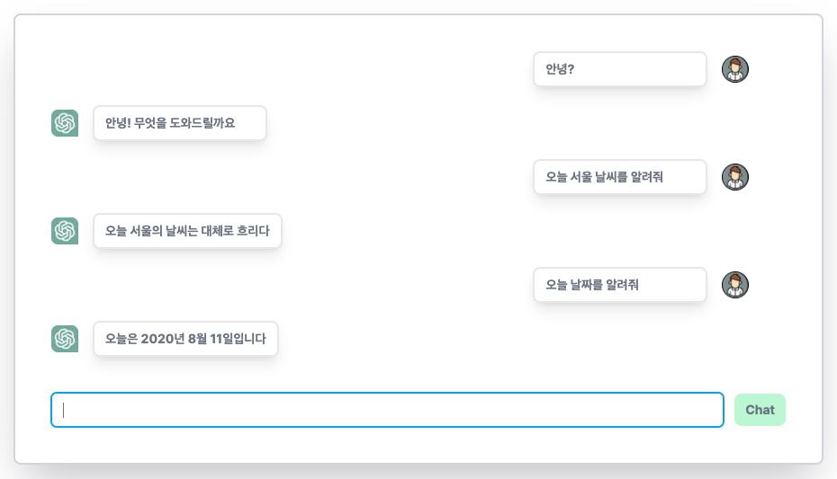

# ChatGPT and 파파고

> ChatGPT와 파파고를 통해 웹 채팅을 구현해보자

- chatGPT만으로 채팅 웹을 구현하고자 했으나 영어에 특화 되어 있는 것 같아 파파고도 같이 사용한다.
- 주요 로직
  - `사용자 입력` => `영어 번역` => `chatGPT 요청` => `한글 번역`

### [chatGPT](https://platform.openai.com/docs/quickstart/build-your-application)

- openai 설치
  ```bash
  npm install openai
  ```
- gpt 요청 보내기

  ```typescript
  const params = {
    prompt: "여기에 텍스트 입력하쇼.",
    model: "text-davinci-003",
    max_tokens: 10,
    temperature: 0,
  };

  const response = await axios({
    url: "https://api.openai.com/v1/completions",
    headers: {
      Authorization: `Bearer ${OPEN_AI_API_KEY}`,
      "Content-Type": "application/json",
    },
    data: {
      ...params,
    },
    method: "POST",
  });
  ```

### [파파고](https://developers.naver.com/docs/papago/papago-nmt-example-code.md#node-js)

- 파파고 한글 => 영어 번역하기
  ```typescript
  const res = await axios({
    url: "https://openapi.naver.com/v1/papago/n2mt",
    method: "POST",
    headers: {
      "X-Naver-Client-Id": PAPAGO_CLIENT_ID,
      "X-Naver-Client-Secret": PAPAGO_CLIENT_SECRET,
    },
    data: {
      source: "ko",
      target: "en",
      text: text,
    },
  });
  ```

### 결과



- ㅋㅋ 뭔가 바보인가보다.
- 잘되는 질문도 있고 아닌것도 있네.

### 참고문서

- [chatGPT-post](https://medium.com/codingthesmartway-com-blog/how-to-use-openai-api-with-axios-and-javascript-dd917ab017bc)
